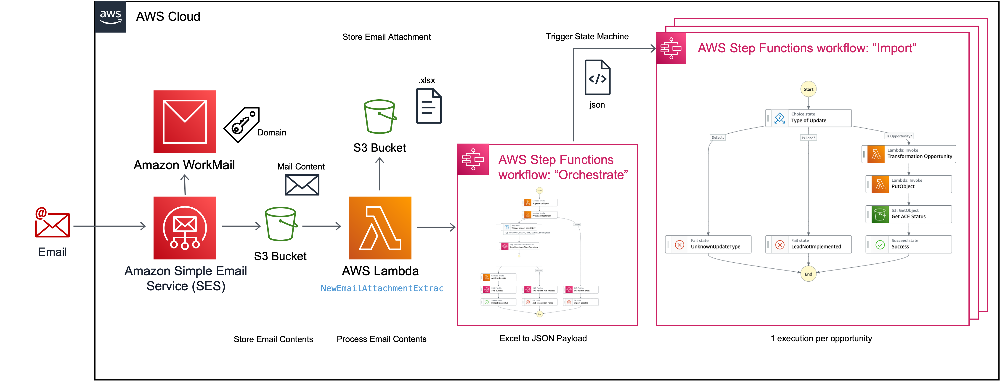

# AWS Partner Custom CRM Connector [](https://github.com/aws-samples/aws-partner-custom-crm-connector/actions/workflows/pipeline.yml)

## Table of Contents
- [Introduction](#introduction)
- [Features](#features)
- [Architecture](#how-it-works)
- [How to setup?](#setup)
- [How to test?](#test)
- [How to update?](#update)
- [Troubleshooting](#troubleshooting)
- [Cost](#costs)
- [Recent Changes](#changelog)

## Introduction

This solution allows AWS Partners in the APN Customer Engagements (ACE) program to share opportunities from their own CRM with AWS to automate and speed up operations. It is an alternative to the official [AWS Partner CRM Connector for Salesforce](https://aws.amazon.com/blogs/apn/accelerate-joint-opportunity-and-lead-sharing-introducing-aws-partner-crm-connector/) and provides the following benefits:
- Supports any CRM
- No custom code required
- Loosely coupled integration
- Extensible

## Features

The following ACE operations are currently supported:

| Feature                            | Status  |
| ---------------------------------- | ------- |
| Send opportunity data to ACE (Insert/Update)       | ✅ |
| Send lead data to ACE              | ❌      |
| Retrieve opportunity data from ACE | ❌      |
| Retrieve leads data from ACE       | ❌      |

## How it works



'Sending opportunity data to ACE' workflow is as follows:

- Partner to generate own CRM Export for opportunity data (Excel/csv)
- Copy data into 'Source' tab of the mapped [Excel Template](https://github.com/aws-samples/aws-partner-custom-crm-connector/raw/main/ace_import_tmpl.xlsx)
- Validate Tab 'Target'
- Send Email to ACE Integration Endpoint with filled excel file attached
- Approve Import (Email Notification)
- Wait for processing to complete (Email Notification)

Please refer to the framework [documentation](/blob/main/doc/ARCHITECTURE.md) for an architectural deep-dive.

## Setup

**Note:** ACE Integration operates in **us-west-2** (Oregon) only!

1. Create dedicated AWS Accounts: Partners must create two AWS accounts, one for '**beta**' and one for '**prod**'. For more information, refer to [How do I create and activate a new AWS account?](https://aws.amazon.com/premiumsupport/knowledge-center/create-and-activate-aws-account/)
2. Locate your **SPMS_ID** in [AWS Partner Central](https://partnercentral.awspartner.com/partnercentral2/s/scorecard): Home -> View Scorecard -> Partner ID
3. Deploy this solution via [AWS Serverless Application Repository](https://us-west-2.console.aws.amazon.com/lambda/home?region=us-west-2#/create/app?applicationId=arn:aws:serverlessrepo:us-west-2:815116410066:applications/aws-partner-custom-crm-connector) - choose **STAGE** **beta** first! Note: Restricting incoming emails to an allowed sender is only a light security measure. Hence, you will need take action on an explicit approval email before import continues! You can only specify a single email address during deployment. If further senders/approvers are required, simply go and add them to the respective SNS topic manually and also adjust the Environment Variable for the related [Lambda function](https://us-west-2.console.aws.amazon.com/lambda/home?region=us-west-2#/functions/) = 'NewEmailAttachmentExtrac'.
4. Once deployment is successfully completed, partners must share the IAM user’s Amazon Resource Name (ARN) of the ACE IAM role **arn:aws:iam::{AWSAccountId}:role/APN-ACE-{SPMS_ID}-AccessUser-{STAGE}** to their AWS Partner Development Manager (PDM) through email. The PDM submits this to the AWS ACE team. This is required to provide access to the partner-specific Amazon S3 bucket for secure data exchange. 
5. The AWS ACE Team will provide a specific AWS KMS Key ARN per STAGE after whitelisting. Navigate to AWS CloudFormation -> [Stacks](https://us-west-2.console.aws.amazon.com/cloudformation/home?region=us-west-2#/stacks?filteringText=serverlessrepo-aws-partner-custom-crm-connector&filteringStatus=active&viewNested=true), select the 'serverlessrepo-aws-partner-custom-crm-connector' and click 'Stack Actions -> Update'. Choose 'Use current template' and adjust the 'ACEKmsEncryptionArn' parameter as per instructions.
6. In Amazon SES - Activate the default RuleSet [Link](https://us-west-2.console.aws.amazon.com/ses/home?region=us-west-2#/email-receiving)
7. Create an Amazon Workmail Organization [Link](https://us-west-2.console.aws.amazon.com/workmail/v2/home?region=us-west-2#/organizations/create): e.g. apn-ace-integration-framework-{SPMS_ID}. Make sure to take note of the email domain.
8. Perform test, see below

Please refer to the AWS ACE framework [documentation]([/blob/main/doc/ARCHITECTURE.md](https://partnercentral.awspartner.com/partnercentral2/s/resources?keyword=CRM)) for more background information.

## Test

**Note:** We recommend to perform testing for 'beta' and 'prod' individually!

1. Generate a sample opportunity export from your own CRM
2. Download this [Excel Template](https://github.com/aws-samples/aws-partner-custom-crm-connector/raw/main/ace_import_tmpl.xlsx), import your CRM data into tab 'Source' and **map the mandatory fields** as well as **Opportunity Stage** attributes:
    - Customer Name
    - Opportunity Title
    - Opportunity Description (min 50. char.)
    - Expected Monthly AWS Consumption
    - Close Date
    - Opportunity ID (unique identifier in your CRM)
    - Contact Email (Sales Contact)
    - Opportunity Stage
3. Validate tab 'Target'
4. Send an email to your ACE Integration Endpoint **opportunity@apn-ace-integration-framework-{SPMS_ID}.awsapps.com** and simply attach the filled excel file.
5. Wait for the approval notification email, hit 'approve' to begin the import. Note: The import will time out after 10 minutes, if approval action is not taken. In this case, simply resend the email.

## Update

Make sure to subscribe to updates, by clicking on 'Watch' in this repo. If you already have deployed an older version of this solution via **AWS Serverless Application Repository**, you can simply update the stack to the latest version as follows:

- Launch an [AWS CloudShell](https://console.aws.amazon.com/cloudshell/home?region=us-west-2) instance
- Execute the following statements - creates ChangeSet but keeps parameters **unchanged**, except password:

```bash
wget https://github.com/aws-samples/aws-partner-custom-crm-connector/raw/main/update.sh
chmod +x update.sh
./update.sh
```

## Troubleshooting

Make sure to check

- CloudWatch Logs for each lambda function
- Step Function Execution logs
- S3 Bucket **ace-partner-integration-{SPMS_ID}-{STAGE}-us-west-2**

Common Errors:

| Error Message                      | Remediation  |
| ---------------------------------- | ------- |
| "Record is not editable"       | The opportunity record exists, but hasn't been accepted = converted by AWS yet. Please re-try after 24h. Once approved, the record can be modified. |
| "Project description must have minimum of 50 characters"              | Make sure to provide a longer description      |
| "User not found for Opportunity Owner email" | You must use a valid APN user email address      |

## Costs

Due to the pure usage of AWS serverless services, the costs should be less than **1$ per month**!
Especially as there are 4000 state transitions included every month as part of the FREE TIER for AWS Step Functions, corresponding to roughly 400 processed opportunities per month.

## Changelog

1.0.0 Initial Release (June 2023)

## Contribute

Found an issue? Anything to add?
See [CONTRIBUTING](CONTRIBUTING.md) for more information.

## License

This project is licensed under  [](./LICENSE)
  
All rights reserved.
