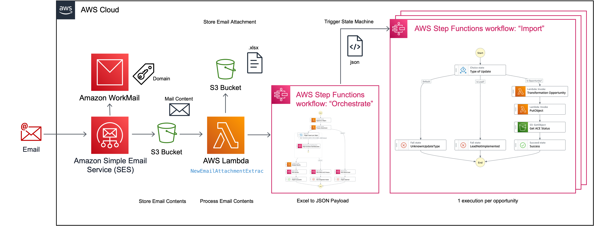
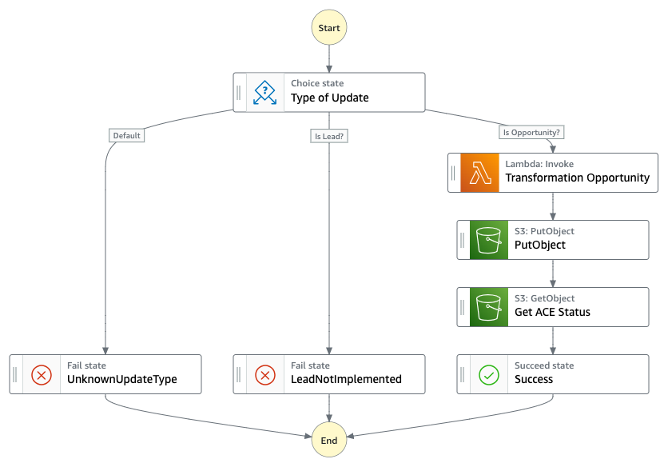

# Architecture Overview



The flow for 'Sending opportunity data to ACE' is as follows:

- Partner to generate own CRM Export (Excel/csv)
- Copy data into 'Source' tab of the mapped [Excel Template](https://github.com/aws-samples/aws-partner-custom-crm-connector/raw/main/ace_import_tmpl.xlsx)
- Validate 'Target' Tab
- Send Email to ACE Integration Endpoint with filled excel file attached
- Approve Import (Email Notification)
- Wait for processing to complete (Email Notification)

State Machine - Orchestrator (AWS Step Function)


State Machine - Import (AWS Step Function)

 

## How to develop

Initial deployment
```bash
sam deploy --guided
```

Further deployment
```bash
sam deploy
```

Run Unit test(s)
```bash
pip install pytest pytest-mock --user
python -m pytest tests/ -v
```
